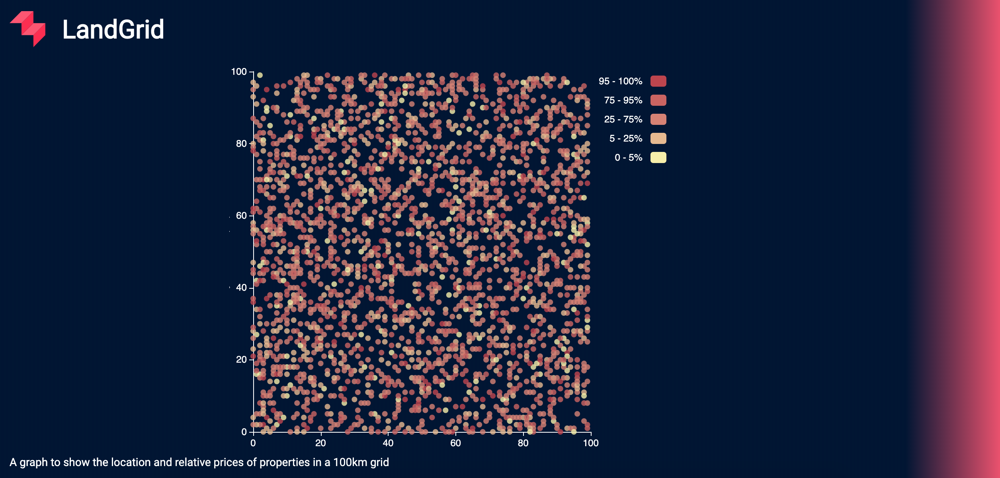

# LandGrid


This is a project which processes housing data on coordinates in a 100km square and each property's price in the following form:

```
x-coordinate y-coordinate price
100          100          2000000
40           68           1029999
...          ...          ...
```
This data is then plotted on an interactive graph where users can:

- Hover over datapoints for a data readout
- Filter properties by price via the legend
- See a visual differentiation between the price of properties relative to each other
- See the location of each property in a 100x100 grid. 



## Running the App
### Locally

#### Prerequesites:
Docker - this is confirmed working on the following builds
- Docker version 19.03.2, build 6a30dfc 
- docker-compose version 1.24.1, build 4667896b
#### Commands
This is a react app that makes use of an express REST api. It can be run locally using docker.
```
git clone https://github.com/whatsrupp/LandGrid

cd location/of/LandGrid

docker-compose up
```

Then head to [http://localhost:3000/](http://localhost:3000/)

## Project
The project board for LandGrid can be found [here](https://github.com/whatsrupp/LandGrid/projects/1)

Here you can find possible future extensions and completed tasks


